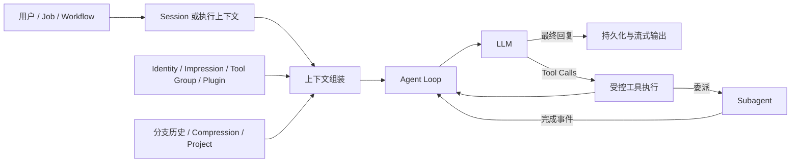

# Hephaestus

> 为长期使用而生的个人 LLM Harness：让模型拥有身份、上下文、工具、记忆与可追溯的行动。

Hephaestus 是一个单用户 AI Agent 平台。它不把大语言模型当作一次性问答接口，而是提供一套可长期运行的 Agent 宿主环境：持久会话、分支历史、可组合的人格与上下文、受控工具调用、Project 工作区、自然语言工作流，以及后台子 Agent。

你可以把它当作自己的 AI 操作台：聊天只是入口；真正的核心是一个能够持续积累上下文、在明确边界内采取行动、并留下完整工作痕迹的 Agent runtime。


## 为什么是 Hephaestus

大模型本身只完成推理；实际可用的 Agent 还需要回答一组更难的问题：

- 这一轮模型是谁，它应遵循哪些长期原则？
- 它看见的是哪条对话分支，旧历史如何在窗口有限时继续可用？
- 它可以使用哪些工具，敏感操作谁来确认？
- 工具、工作流和并发委派的结果如何回到对话，而不丢失上下文？
- 当配置被修改、服务重启或回复中断时，运行痕迹如何保留？

Hephaestus 将这些问题收敛为一套清晰的运行模型：



## 关键能力

### 可组合的 Agent 配方

每个 **Concierge** 是一个可复用的 Agent 配方，由以下部分按顺序组合：

- **Identity**：系统提示、注入消息、模型偏好与生成参数。
- **Impression**：长期背景、行为原则、角色设定或 few-shot 消息序列。
- **Tool Group**：以能力组形式向模型开放内置工具。
- **Plugin**：在模型调用和工具循环的生命周期中运行的平台扩展。

Session 从 Concierge 创建后拥有独立设置。你可以在不中断历史的前提下切换身份、启停 Impression、工具组或 Plugin。

### 真正的 Agent Tool Loop

每轮执行都由统一的 Agent Runner 驱动：调用模型、解析工具调用、执行工具、将结果写回模型上下文，再持续循环直至生成最终回答。工具调用具备作用域过滤、输出限额、审计记录与敏感操作确认，不是简单的 Function Calling 透传。

### 长期记忆，而非单线聊天记录

会话保存完整消息树，当前活跃分支由 `active_leaf_message_id` 决定。编辑、重新生成和从旧消息继续对话都会形成可回看的分支，而非覆盖原记录。上下文接近模型窗口时，平台压缩较早历史，同时保留近期原始消息和可继续对话的关键信息。

### Project 是 Agent 的工作现场

Project 将会话、上传文件和工作目录组织在一起。模型可以在受控范围内检索历史、处理附件、访问 Project 文件、搜索网页，或在显式启用后执行本地或远程 Shell 命令。

### Workflow、Job 与 Subagent

- **Workflow**：将一项可重复工作拆成顺序执行的自然语言步骤；每一步都是独立、可持久化的 Agent Tool Loop。
- **Job**：根据时间、会话活跃度和历史运行状态触发 Workflow。
- **Subagent**：支持前台 `fork` 或后台 `spawn` 委派；后台任务完成后以持久事件回流父会话，空闲会话也能自动恢复一轮处理结果。


## 快速开始

### 前置条件

- Go 1.26 或更高
- Node.js 22 或更高，以及 npm
- SQLite 或 PostgreSQL
- 至少一个可用模型提供方：DeepSeek API，或 OpenAI 兼容的本地模型服务

Hephaestus 依赖一个带 `replace` 指令的 GoQQBot 分支，因此不支持 `go install`。请克隆仓库后构建：

```sh
git clone https://github.com/Cyvadra/hephaestus.git
cd hephaestus
make build-server
```

从仓库根目录配置环境变量。可以从 `.env.example` 开始：

```sh
cp .env.example .env
```

至少设置认证、数据库、环境位置，以及一个模型来源：

```dotenv
HEPHAESTUS_AUTH_USERNAME=your-name
HEPHAESTUS_AUTH_PASSWORD=choose-a-strong-password
HEPHAESTUS_JWT_SECRET=at-least-32-random-bytes
HEPHAESTUS_DATABASE_URL=sqlite://./data/hephaestus.db

# 二选一：DeepSeek 或本地 OpenAI-compatible 服务
HEPHAESTUS_DEEPSEEK_API_KEY=your-api-key
# HEPHAESTUS_LOCAL_MODEL_URL=http://127.0.0.1:11434/v1

HEPHAESTUS_ENV_LOCATION=My Workspace
HEPHAESTUS_ENV_LATITUDE=39.9042
HEPHAESTUS_ENV_LONGITUDE=116.4074
HEPHAESTUS_ENV_TIMEZONE=Asia/Shanghai
```

启动 API：

```sh
go run ./cmd/hephaestus
```

默认监听 `http://127.0.0.1:9016`，Swagger API 文档位于：

```text
http://127.0.0.1:9016/swagger/index.html
```

在另一个终端启动网页界面：

```sh
cd frontend
npm install
npm run dev
```

默认访问地址：

```text
http://127.0.0.1:5173
```

## 首次使用

1. 创建一个 Project 和 Session。
2. 选择 Concierge，或直接使用默认通用助理。
3. 开始对话；模型会在当前 Session 的身份、上下文、Project 和工具边界内执行。
4. 用斜杠命令查看或调整当前运行环境。

常用本地命令不会写入聊天记录，也不会发送给模型：

| 命令 | 作用 |
| --- | --- |
| `/help`、`/ping` | 查看命令帮助或服务连通性。 |
| `/status` | 查看当前身份、Project、上下文估算和近期告警。 |
| `/list <kind>`、`/detail <kind> <id>` | 浏览配置、会话、Project、Workflow 与 Job。 |
| `/switch` | 切换 Identity、Concierge、Project 或其他 Session。 |
| `/activate`、`/deactivate` | 调整当前 Session 的 Impression、Tool Group 或非固定 Plugin。 |
| `/clear [true|false]` | 基于当前 Session 设置新建会话。 |
| `/new [true|false]` | 从源 Concierge 当前设置新建会话。 |
| `/stop` | 请求停止当前运行。 |
| `/interact approve\|deny` | 对敏感操作给出明确授权或拒绝。 |
| `/interact auto-approve` | 为本进程内当前 Session 临时开启自动授权。 |

`/list <kind>` 显示的条目可以使用序号（如 `1` 或 `#1`）引用；`/switch session <ordinal|#session-id>` 可切换到另一条持久 Session。

## 运行模型

### 配置层与运行层

`config/` 中的 Identity、Impression、Tool Group、Concierge、Workflow 和 Job 是可读、可版本管理的基线配置。启动时，这些模板会同步至数据库；之后的运行时修改会被完整校验，并原子地用于新一轮执行。

配置变更不会悄悄改变已经开始的 Workflow 或 Job。运行会捕获自己的定义，保证执行记录可以解释和回看。

### Session 上下文

每次模型调用前，系统会构建当前有效上下文：

```text
渲染后的 Identity
+ Identity 注入消息
+ 有序 Impression
+ Plugin 注入内容
+ 当前分支可用的 Compression
+ 当前分支近期历史
+ Project 与附件上下文
+ 本轮用户输入
+ 当前允许的工具定义
```

这也是 Hephaestus 与“把聊天记录原样塞回模型”的区别：模型看见的身份、记忆与能力始终来自明确的配置与运行状态。

### 工具、网页与附件

默认工具组可覆盖聊天历史检索、Project 管理、网页搜索、网页获取和 Shell。`web_search` 聚合 DuckDuckGo、Sogou 以及可选的 Brave、Tavily、SerpAPI、SearXNG；`web_fetch` 默认经由 Firecrawl，并可回退到本地无头浏览器。

一条用户消息最多可附带五个附件。允许的小文本文件会直接进入本轮提示词；JPEG、PNG、GIF、WebP 可作为视觉输入发送给当前模型；其他文件仍会保存在 Project 中并保留受控引用。

Shell 默认关闭。启用后，高风险操作会要求确认；`/interact auto-approve` 的授权只存在于当前服务进程，重启后自动失效。

## 内置 Plugin

Plugin 在模型调用与工具循环的生命周期中运行。`HEPHAESTUS_FIXED_PLUGINS` 列出的 Plugin 对每个 Session 固定启用且不可停用，其余可在 Concierge 或 Session 中按需开关。

| 名称 | 作用 |
| --- | --- |
| `environment` | 在首条消息中注入时间、地点和天气等基础环境信息。 |
| `metaphysics` | 在首条消息中注入黄历、四柱和奇门遁甲等玄学信息。 |
| `session_summary` | 自动生成并定期更新会话标题和摘要。 |
| `storyline_status` | 在每条助手回复后追加当前剧情状态。 |
| `traditional-cc` | 将首条用户消息的简体中文转换为繁体中文。 |
| `options` | 在回复后生成可选的下一条用户消息建议。 |

## 配置参考

后端会读取进程环境变量以及工作目录中的可选 `.env` 文件。下表中“必需”代表对应功能启用时必须提供。

| 环境变量 | 默认值 | 说明 |
| --- | --- | --- |
| `HEPHAESTUS_AUTH_USERNAME` | 必需 | 单用户登录名。 |
| `HEPHAESTUS_AUTH_PASSWORD` | 必需 | 单用户登录密码；按设计以明文保存在 `.env`，请限制文件权限。 |
| `HEPHAESTUS_JWT_SECRET` | 必需 | 至少 32 字节的 JWT 签名密钥；不要复用登录密码。 |
| `HEPHAESTUS_DATABASE_URL` | 必需 | 会话、历史、配置和运行数据；本地可用 `sqlite://./data/hephaestus.db`。 |
| `HEPHAESTUS_DEEPSEEK_API_KEY` | 本地模型未配置时必需 | 启用 DeepSeek 与基于 LLM 的网页内容压缩。 |
| `HEPHAESTUS_LOCAL_MODEL_URL` | 无 | OpenAI-compatible 本地模型服务地址。 |
| `HEPHAESTUS_LOCAL_MODEL_API_KEY` | 无 | 本地模型服务的可选 API Key。 |
| `HEPHAESTUS_CONFIG_DIR` | `./config` | 默认 Registry 模板目录。 |
| `HEPHAESTUS_LISTEN_ADDR` | `127.0.0.1:9016` | API 监听地址。 |
| `HEPHAESTUS_COOKIE_SECURE` | `false` | 由反向代理终止 HTTPS 时设为 `true`，会话 Cookie 才会带上 `Secure`。 |
| `HEPHAESTUS_PROJECTS_ROOT` | `./data/projects` | Project 目录根路径，支持 `~`。 |
| `HEPHAESTUS_PROJECT_ACCESS_OVERRIDE` | `false` | 允许文件工具访问 Project 与系统临时目录外的路径。 |
| `HEPHAESTUS_SHELL_ENABLED` | `false` | 是否启用 Shell 工具。 |
| `HEPHAESTUS_SHELL_BACKEND` | `local` | Shell 目标：`local` 或 `ssh`。 |
| `HEPHAESTUS_SHELL_SSH_DESTINATION` | 无 | SSH Shell 启用时必需；可为 SSH config 别名或 `user@host`。 |
| `HEPHAESTUS_SHELL_SSH_PROJECTS_ROOT` | 无 | SSH Shell 启用时必需；远端 Project 根目录的绝对 POSIX 路径。 |
| `HEPHAESTUS_ENV_LOCATION` | 必需 | 新 Session 首轮上下文中的位置名称。 |
| `HEPHAESTUS_ENV_LATITUDE` | 必需 | 环境纬度，范围 `-90` 至 `90`。 |
| `HEPHAESTUS_ENV_LONGITUDE` | 必需 | 环境经度，范围 `-180` 至 `180`。 |
| `HEPHAESTUS_ENV_TIMEZONE` | 必需 | IANA 时区，用于时间、农历与四柱计算。 |
| `HEPHAESTUS_WEATHER_PROVIDERS` | `open_meteo,wttr,met_no` | 首轮环境上下文使用的天气服务回退顺序。 |
| `HEPHAESTUS_FIXED_PLUGINS` | `environment,metaphysics,session_summary` | 每个 Session 固定启用、不可停用的 Plugin。 |
| `HEPHAESTUS_SUBAGENT_MAX_DEPTH` | `2` | `spawn` / `fork` 的最大递归委派深度。 |
| `HEPHAESTUS_PROXY_URL` | 无 | 仅供 `make deploy`：为 PM2 进程注入出站代理；留空则不注入。 |
| `HEPHAESTUS_NO_PROXY` | `127.0.0.1,localhost` | 仅供 `make deploy`：代理排除列表。 |
| `HEPHAESTUS_WECOM_WEBHOOK_URL` | 无 | 接收警告和错误通知的企业微信 Webhook。 |
| `HEPHAESTUS_WEB_FETCH_PROVIDER` | `firecrawl` | 网页抓取实现：`firecrawl` 或 `local`。 |
| `HEPHAESTUS_FIRECRAWL_API_KEY` | 使用 Firecrawl 时必需 | Firecrawl API Key。 |
| `HEPHAESTUS_WEB_FETCH_CHROME_PATH` | 自动检测 | 本地抓取使用的 Chrome 或 Chromium 路径。 |
| `HEPHAESTUS_WEB_FETCH_MAX_CHARS` | `16000` | 页面捕获文本上限，之后会摘要或截断。 |
| `HEPHAESTUS_WEB_FETCH_SUMMARY_MAX_CHARS` | `4000` | LLM 生成页面摘要的最大长度。 |
| `HEPHAESTUS_WEB_SEARCH_BRAVE_API_KEYS` | 无 | 逗号分隔的 Brave Search API Key。 |
| `HEPHAESTUS_WEB_SEARCH_TAVILY_API_KEYS` | 无 | 逗号分隔的 Tavily API Key。 |
| `HEPHAESTUS_WEB_SEARCH_SERPAPI_API_KEYS` | 无 | 逗号分隔的 SerpAPI API Key。 |
| `HEPHAESTUS_WEB_SEARCH_SERPAPI_ENGINE` | `google_light` | SerpAPI 搜索引擎标识。 |
| `HEPHAESTUS_WEB_SEARCH_SEARXNG_BASE_URL` | 无 | 可选 SearXNG 服务地址。 |
| `HEPHAESTUS_WEB_SEARCH_SUMMARY_MAX_CHARS` | `4000` | LLM 生成搜索摘要的最大长度。 |
| `HEPHAESTUS_QQ_APP_ID` | 无 | 可选 QQ 频道 Bot AppID；三项 QQ 配置需要同时设置。 |
| `HEPHAESTUS_QQ_APP_SECRET` | 无 | QQ Bot AppSecret。 |
| `HEPHAESTUS_QQ_USER_OPENID` | 无 | 被允许接入此单用户部署的 QQ 用户 OpenID；留空时见下方 QQ Channel 一节。 |
| `HEPHAESTUS_CHANNEL_IMAGE_TEXT_WAIT_SECONDS` | `30` | 纯图片消息等待随后文字消息的时长。 |
| `HEPHAESTUS_UPLOAD_TEXT_EXTENSIONS` | `md,markdown,txt,csv,json,yaml,yml,toml,xml` | 可直接纳入提示词的文本扩展名。 |
| `HEPHAESTUS_UPLOAD_IMAGE_EXTENSIONS` | `jpg,jpeg,png,gif,webp` | 经 MIME 校验后可直接作为视觉输入的扩展名。 |
| `HEPHAESTUS_UPLOAD_INLINE_TEXT_MAX_BYTES` | `10240` | 可直接注入提示词的单个文本文件大小上限。 |
| `HEPHAESTUS_UPLOAD_FILE_MAX_BYTES` | `52428800` | 单个附件最大大小。 |
| `HEPHAESTUS_UPLOAD_TOTAL_MAX_BYTES` | `262144000` | 单条消息全部附件最大大小。 |
| `HEPHAESTUS_UPLOAD_MAX_FILES` | `5` | 单条消息最多附件数。 |

单文件上限不能超过单条消息附件总上限。

`HEPHAESTUS_UPLOAD_OCR_IMAGE_MAX_BYTES`、`HEPHAESTUS_BAIDU_OCR_API_KEY` 与 `HEPHAESTUS_BAIDU_OCR_SECRET_KEY` 已废弃并会被忽略。`HEPHAESTUS_POSTGRES_DSN` 是 `HEPHAESTUS_DATABASE_URL` 的废弃别名，仍可用但启动时会打印提示。

## Subagent

在 Concierge 中启用 `subagent` Tool Group 后，模型可以获得三个受控委派工具：

- `spawn`：后台启动独立 Child Session，并立即返回运行 ID。
- `fork`：从当前对话播种独立 Child Session，并等待结果。
- `await`：等待调用时已存在的直属后台任务。

后台任务的结果不会只停留在临时内存。完成事件会先持久化；若父 Session 正在运行，结果会在下一次模型边界注入；若 Session 空闲，系统会自动恢复一轮，让父 Agent 消化这项新信息。

## QQ Channel

设置 `HEPHAESTUS_QQ_APP_ID` 与 `HEPHAESTUS_QQ_APP_SECRET` 即可启用 QQ C2C Channel，两者必须同时提供。三项都不设置时，应用不会启动外部 Channel。

`HEPHAESTUS_QQ_USER_OPENID` 限定唯一允许接入的用户。首次部署时可以留空：此时 Bot 会向任何发信人回复其自己的 OpenID 且不处理消息，便于取得该值后填回配置并重启。

每个 QQ 会话会串行处理消息并绑定一个持久 Session；首次消息从默认 Concierge 创建 Session。`/new`、`/clear` 和 Session 切换会更新该绑定。外部 Channel 等待完整回复而不转发模型增量；附件会复制到 Session 的 Project，Agent 交付的文件也可回传到 QQ。

权限请求作为独立提示发送，下一条 QQ 回复将作为决定。包含 `确认` 或 `yes`，或仅为 `y`、`1` 的回复会批准请求；未答复请求会按部署的超时策略自动处理。

## 远程 SSH Shell

设置 `HEPHAESTUS_SHELL_BACKEND=ssh` 后，既有的 `shell` 工具会在远端执行，工具名称和参数不变。服务通过系统 `ssh` 命令并使用 `BatchMode=yes`；请在启动前通过 `~/.ssh/config` 或 SSH agent 配置认证、主机密钥、端口和 `ProxyJump`。

对于名为 `default` 的 Project，本地文件工作区与远端 Shell 工作区是有意分离的：

```text
本地：<HEPHAESTUS_PROJECTS_ROOT>/default
远端：<HEPHAESTUS_SHELL_SSH_PROJECTS_ROOT>/default
```

请在启用前创建并准备远端目录。SSH Shell 不同步本地 Project 文件、上传内容或 `AGENTS.md`；文件工具仍然访问本地 Project。相对 `working_directory` 相对于远端 Project，绝对路径代表远端绝对路径。默认仅允许当前远端 Project 与 `/tmp`；设置 `HEPHAESTUS_PROJECT_ACCESS_OVERRIDE=true` 才允许其他远端路径。

## 部署

生产环境中，前端监听所有接口的 `5173` 端口；API 保持绑定在 `127.0.0.1:9016`，由 Vite 的同源 `/api` 代理访问。部署前请准备 Go、Node.js、PM2 和生产环境变量：

```sh
cp .env.example .env
# 编辑 .env 后继续
make deploy
```

`make deploy` 会构建后端和前端、通过 PM2 创建或重启 `hephaestus-api` 与 `hephaestus-web`、保存 PM2 进程列表，并验证本机 `9016` 和 `5173` 端口可连接。每次修改 `.env` 后都应重新执行该命令。

仓库根目录的 `.env` 是生产配置的权威来源。服务启动时会用其中的值覆盖 PM2 或父进程遗留的同名变量，因此不会继续使用旧的模型地址或密钥。`make deploy-build` 仍只负责构建，适用于不需要重启服务的场景。

部署后可用 `curl -s 127.0.0.1:9016/healthz` 确认 API 存活及其构建版本。

不要将 HTTP 监听器直接暴露到互联网。请在 TLS 终止的反向代理后部署，并将 `/api` 转发到前端；后端 `9016` 端口应保持私有。此时必须设置 `HEPHAESTUS_COOKIE_SECURE=true`，否则会话 Cookie 不会带上 `Secure` 属性。前端采用 SPA 路由，生产静态主机或反向代理需要将未知的非 `/api` 路由回退至 `index.html`。

需要私有远程访问时，可使用 SSH 转发：

```sh
ssh -N -L 5173:127.0.0.1:5173 user@server
```

然后访问 `http://127.0.0.1:5173`。

## 验证

```sh
make check   # go vet + golangci-lint + go test -race
make build
```

`make check` 需要 golangci-lint v1.64 或更高。单独的 `make test`、`make vet`、`make lint` 仍然可用。设置 `HEPHAESTUS_TEST_POSTGRES_DSN` 后可用 `make test-integration` 在真实 Postgres 上运行集成测试。

服务运行后，`GET /healthz` 返回运行状态与构建版本，无需认证；`./hephaestus --version` 输出同一版本号。

## 设计边界

- Hephaestus 面向一个受信任的长期使用者，不是多租户协作平台。
- Project 是工作上下文与文件组织边界，不是多用户安全隔离边界。
- 聊天历史检索不依赖向量数据库。
- 配置、消息分支、工具调用和自动化运行优先保留，以便复盘、调试和继续工作。
- 文件、Shell、网页抓取和外部 Channel 都可能触及外部系统；请结合部署环境审慎启用。

## 文档

- [`docs/release/Hephaestus.md`](./docs/release/Hephaestus.md)：核心概念与运行模型的完整说明。
- [`SECURITY.md`](./SECURITY.md)：威胁模型、认证设计与部署要求。
- [`CONTRIBUTING.md`](./CONTRIBUTING.md)：开发环境、检查命令与配置文件约定。
- [`CHANGELOG.md`](./CHANGELOG.md)：版本变更记录。

## 致谢

初始 `pkg/channels` 实现改编自 PicoClaw 的 [`pkg/channels`](https://github.com/sipeed/picoclaw/tree/main/pkg/channels)，遵循 MIT License。

部分 Agent Harness 实现与 Identity 配置参考 DeepSeek 的 [`deepseek-harness`](https://github.com/deepseek-ai/deepseek-harness)，遵循 MIT License。

QQ Channel 使用 [GoQQBot](https://github.com/ProgramCX/GoQQBot) 的分支，遵循 MIT License。

完整的第三方版权与许可声明见 [`THIRD_PARTY_NOTICES.md`](./THIRD_PARTY_NOTICES.md)。Hephaestus 自身以 GNU GPL v3 发布。