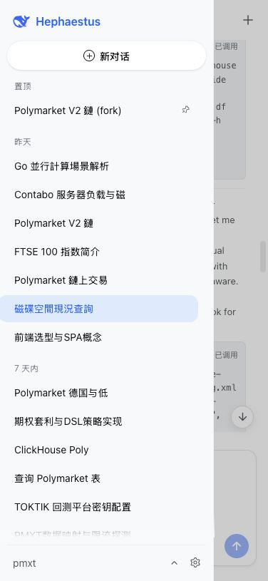
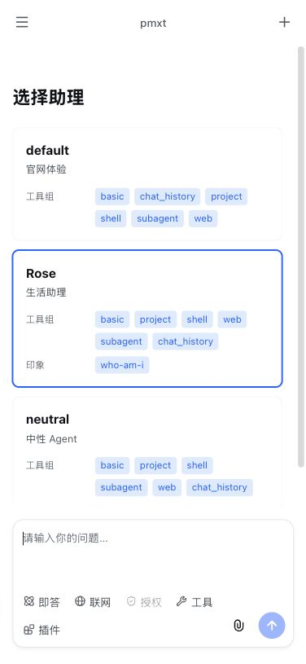
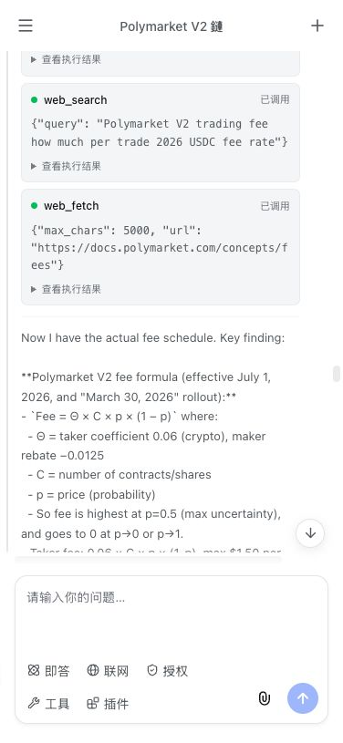
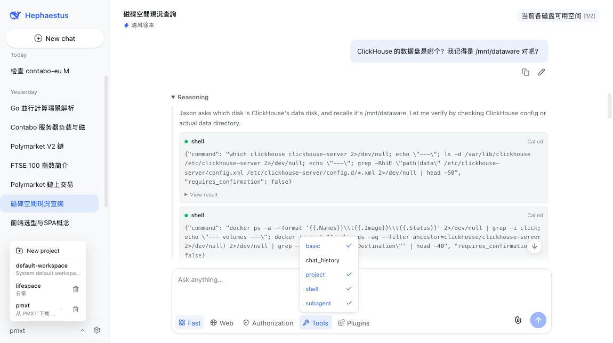

# Hephaestus

Hephaestus is a single-user AI agent framework with a Go API and a React chat
interface. It combines persistent, project-scoped conversations with
configurable agent personas, tools, plugins, and human approval for sensitive
runtime operations.

The initial `pkg/channels` implementation is adapted from PicoClaw's
[`pkg/channels`](https://github.com/sipeed/picoclaw/tree/main/pkg/channels),
which is licensed under the MIT License.

## What It Does

- Runs multi-turn LLM chat sessions with streaming responses, regeneration,
	continuation, and editable assistant messages.
- Keeps sessions in projects, with project-scoped uploads and file access.
- Selects identities, concierges, impressions, tool groups, and plugins per
	session so one installation can support distinct agent workflows.
- Lets agents search chat history, create and list projects, search the web,
	fetch web pages, and optionally run shell commands.
- Supports local OpenAI-compatible model servers alongside DeepSeek. Model
	routing uses an identity's `preferred_model`; a local model takes precedence
	when it has the same advertised ID as DeepSeek.
- Stores small, approved text attachments in the conversation context and can
	extract text from supported images using Baidu OCR.
- Provides slash commands for session control and runtime selection, including
	`/help`, `/status`, `/list`, `/switch`, `/activate`, `/deactivate`, `/clear`,
	`/new`, `/stop`, and `/interact`.

## Run It

Start the API from the repository root:

```sh
go run ./cmd/hephaestus
```

The API listens at `http://127.0.0.1:9016` by default. Interactive API
documentation is available at `http://127.0.0.1:9016/swagger/index.html`.

For the React interface, start Vite in a separate terminal:

```sh
cd frontend
npm install
npm run dev
```

The development server proxies `/api` requests to the backend.

Usually you can access site on `http://127.0.0.1:5173`.

### Remote Linux Deployment

The production frontend listens on all interfaces at port `5173`; the API stays
bound to `127.0.0.1:9016` and is reached through Vite's same-host `/api` proxy.
After cloning the repository on a Linux server, install Go, Node.js, and PM2,
then configure and start it from the repository root:

```sh
cp .env.example .env
# Edit .env before continuing.
make deploy-build
pm2 start ecosystem.config.cjs
pm2 save
```

The PM2 applications are named `hephaestus-api` and `hephaestus-web`. Use
`pm2 status`, `pm2 logs`, and `pm2 restart ecosystem.config.cjs` to manage
them. After pulling an update, run `make deploy-build` and restart both apps.

Open `http://server-address:5173` from a permitted network. Do not expose this
HTTP listener directly to the internet: terminate HTTPS in a reverse proxy and
forward its `/api` requests to the frontend. The backend port `9016` should stay
private; Vite forwards `/api` to it locally.

For a private server, SSH forwarding remains an option:

```sh
ssh -N -L 5173:127.0.0.1:5173 user@server
```

Then open `http://127.0.0.1:5173`. The frontend proxies `/api` to the backend
on the server, so port 9016 does not need a separate tunnel or firewall rule.

The React frontend uses browser routes for projects, chats, and configuration
pages. In production, configure the static host or reverse proxy to return the
frontend `index.html` for unknown non-`/api` paths. Without this SPA fallback,
refreshing or directly opening a nested frontend URL returns 404.

Preview:

<table>
	<tr>
		<td></td>
		<td></td>
		<td></td>
	</tr>
	<tr>
		<td colspan="3"></td>
	</tr>
</table>

## Use It

Create a project and a session through the chat interface or the API, then
send a message. The selected concierge supplies the initial session setup;
use slash commands in the message box to inspect or change its runtime
settings. Commands are handled locally and are neither stored in chat history
nor sent to the model.

Use `/list <kind>` to enumerate available `identity`, `impression`,
`toolgroup`, `plugin`, `concierge`, `session`, `job`, `workflow`, and `project`
entries. `/detail <kind> <id>` shows an entry, `/switch` changes the identity
or concierge, or moves the session to another available project; `/activate`
or `/deactivate` adjusts impressions, tool groups, and plugins. After
`/list <kind>`, commands may use the displayed ordinal (for example, `1` or
`#1`) or the entry name. When an operation asks for approval, respond with
`/interact approve` or `/interact deny`. `/interact auto-approve` enables
automatic approval for the current session for this server process and
approves a request already waiting in that session; use
`/interact cancel-auto-approve` to turn it off.

`/clear [true|false]` starts and selects a new session with the current
session's settings. `/new [true|false]` instead starts it from the source
concierge's current settings. Their optional `archive` argument defaults to
`false`, so the current session remains available; pass `true` to archive it
while creating the new session.

`/switch session <ordinal|#session-id>` selects another session without
changing either session. The ordinal comes from the most recent `/list session`
for the current conversation; `#session-id` is a stable session ID. Session
selection may target archived sessions and sessions in other projects.

### Web Tools

`web_search` always queries DuckDuckGo and Sogou and can combine optional
Brave, Tavily, SerpAPI, and SearXNG providers. It returns up to seven diverse
results. `web_fetch` retrieves a page with Firecrawl by default and falls back
to a local headless browser when Firecrawl fails. Long search results and page
content are condensed when an LLM is available; otherwise the content is
truncated to the configured limit.

The local browser requires Chrome, Chromium, or `headless-shell`. Its page,
redirect, and subresource requests pass through a loopback filtering proxy
that blocks private and local network destinations. Firecrawl sends the target
URL and fetched content through Firecrawl's infrastructure.

### Files and OCR

Each chat message accepts up to five attachments. Hephaestus stores them in
the session project's `uploads/YYYY-MM-DD` directory. Text files with allowed
extensions and within the configured size limit are included directly in the
prompt. Supported images are sent to Baidu OCR when both OCR credentials are
available. Other files, and files whose OCR fails, remain available by their
project-relative path and size; the chat response reports an extraction
warning when applicable.

### Registry API

Static identity, impression, tool-group, concierge, workflow, and job files
are default templates synchronized into PostgreSQL at startup. Runtime config
is then loaded exclusively from the database. Missing records are created;
existing records are preserved on the first migration, and later template
content changes replace a record only when the template file is newer than the
database record. A semantic content hash prevents checkout or file-copy mtime
changes from causing an unnecessary replacement.

Every API change is validated against the complete database registry before it
commits, then becomes active atomically for new turns. Deleting a record takes
effect immediately. If a same-named default template still exists, the record
is restored at the next process start. Removing a template file does not delete
its database record.

Manage persisted records at `/api/v1/configurations/:kind`, where `:kind` is
`identities`, `impressions`, `tool-groups`, `concierges`, `workflows`, or
`jobs`:

| Method | Path | Operation |
| --- | --- | --- |
| `GET` | `/configurations/:kind` | List persisted records. |
| `POST` | `/configurations/:kind` | Create a record. |
| `GET` | `/configurations/:kind/:name` | Read a persisted record. |
| `PUT` | `/configurations/:kind/:name` | Replace a persisted record. |
| `DELETE` | `/configurations/:kind/:name` | Delete a record until a possible template restore at next startup. |

## Environment Reference

The backend reads process environment variables and an optional `.env` file in
the working directory. Required values are marked below; use either a DeepSeek
key or a local model URL. Firecrawl is required only when it is the selected
web-fetch provider.

The browser sends a short-lived SHA-256 login proof instead of the plaintext
password. After five failed logins within ten minutes, the server additionally
requires a two-minute, 18-bit SHA-256 proof-of-work challenge before checking
more credentials. The adaptive gate is global because Hephaestus is a
single-user service; it supplements rather than replaces reverse-proxy rate
limits. This does not replace HTTPS: expose a non-loopback installation only
behind a TLS-terminating reverse proxy. Sessions use 14-day JWTs and refresh
automatically when seven or fewer days remain. The JWT is also stored in an
`HttpOnly`, `SameSite=Strict` cookie for downloads and browser-native SSE.

| Variable | Default | Effect |
| --- | --- | --- |
| `HEPHAESTUS_AUTH_USERNAME` | required | Single-user login username. |
| `HEPHAESTUS_AUTH_PASSWORD` | required | Single-user login password, stored as plaintext in `.env` by design. Restrict the file's permissions. |
| `HEPHAESTUS_JWT_SECRET` | required | At least 32-byte secret used to sign JWT sessions. Generate a unique random value and do not reuse the login password. |
| `HEPHAESTUS_DATABASE_URL` | required | Database URL for sessions, chat history, registry overrides, and runtime data. Set `sqlite://./data/hephaestus.db` for local SQLite, or a PostgreSQL DSN/URL for PostgreSQL. |
| `HEPHAESTUS_DEEPSEEK_API_KEY` | required unless local model URL is set | Enables DeepSeek models and LLM-based web-content condensation. |
| `HEPHAESTUS_LOCAL_MODEL_URL` | none | Base URL of an OpenAI-compatible local model server; trailing `/` is removed. |
| `HEPHAESTUS_LOCAL_MODEL_API_KEY` | none | Optional API key for the local model server. |
| `HEPHAESTUS_CONFIG_DIR` | `./config` | Directory containing default registry templates synchronized at startup. |
| `HEPHAESTUS_LISTEN_ADDR` | `127.0.0.1:9016` | HTTP server bind address. |
| `HEPHAESTUS_PROJECTS_ROOT` | `./data/projects` | Root directory for named projects and their uploads. Supports `~`. |
| `HEPHAESTUS_PROJECT_ACCESS_OVERRIDE` | `false` | Allows filesystem tools to access paths outside the project and system temporary directory. |
| `HEPHAESTUS_SHELL_ENABLED` | `false` | Enables the shell tool. |
| `HEPHAESTUS_SHELL_BACKEND` | `local` | Shell execution target: `local` or `ssh`. |
| `HEPHAESTUS_SHELL_SSH_DESTINATION` | none | Required for enabled SSH shell execution. An SSH config host alias or `user@host`; OpenSSH manages authentication, host verification, and proxies. |
| `HEPHAESTUS_SHELL_SSH_PROJECTS_ROOT` | none | Required for enabled SSH shell execution. Absolute POSIX directory containing remote Projects. |
| `HEPHAESTUS_ENV_LOCATION` | required | Display name for the location included in a new session's first message. |
| `HEPHAESTUS_ENV_LATITUDE` | required | Latitude of the configured environment location, from `-90` to `90`. |
| `HEPHAESTUS_ENV_LONGITUDE` | required | Longitude of the configured environment location, from `-180` to `180`. |
| `HEPHAESTUS_ENV_TIMEZONE` | required | IANA timezone used for time, lunar date, and four-pillar calculation. |
| `HEPHAESTUS_WEATHER_PROVIDERS` | `open_meteo,wttr,met_no` | Ordered public weather providers used as fallback for first-turn context. |
| `HEPHAESTUS_FIXED_PLUGINS` | `metaphysics,session_summary` | Comma-separated plugins that run for every session and cannot be disabled. |
| `HEPHAESTUS_SUBAGENT_MAX_DEPTH` | `2` | Maximum recursive spawn/fork delegation depth. |
| `HEPHAESTUS_WECOM_WEBHOOK_URL` | none | WeCom webhook that receives warning and error notifications. |
| `HEPHAESTUS_WEB_FETCH_PROVIDER` | `firecrawl` | Primary page-fetch provider: `firecrawl` or `local`. |
| `HEPHAESTUS_FIRECRAWL_API_KEY` | required for `firecrawl` | Firecrawl API key. |
| `HEPHAESTUS_WEB_FETCH_CHROME_PATH` | auto-detected | Chrome or Chromium executable for the local fetch provider. |
| `HEPHAESTUS_WEB_FETCH_MAX_CHARS` | `16000` | Maximum captured page text before summarization or raw truncation. |
| `HEPHAESTUS_WEB_FETCH_SUMMARY_MAX_CHARS` | `4000` | Maximum size of an LLM-generated page digest. |
| `HEPHAESTUS_WEB_SEARCH_BRAVE_API_KEYS` | none | Comma-separated Brave Search API keys. |
| `HEPHAESTUS_WEB_SEARCH_TAVILY_API_KEYS` | none | Comma-separated Tavily API keys. |
| `HEPHAESTUS_WEB_SEARCH_SERPAPI_API_KEYS` | none | Comma-separated SerpAPI keys. |
| `HEPHAESTUS_WEB_SEARCH_SERPAPI_ENGINE` | `google_light` | SerpAPI search engine identifier. |
| `HEPHAESTUS_WEB_SEARCH_SEARXNG_BASE_URL` | none | Base URL for an optional SearXNG provider. |
| `HEPHAESTUS_WEB_SEARCH_SUMMARY_MAX_CHARS` | `4000` | Maximum size of an LLM-generated search-result digest. |
| `HEPHAESTUS_BAIDU_OCR_API_KEY` | none | Baidu OCR API key; must be set with the OCR secret. |
| `HEPHAESTUS_BAIDU_OCR_SECRET_KEY` | none | Baidu OCR secret key; must be set with the OCR API key. |
| `HEPHAESTUS_QQ_APP_ID` | none | QQ Bot AppID for the optional QQ chat Channel; set all three QQ variables together. |
| `HEPHAESTUS_QQ_APP_SECRET` | none | QQ Bot AppSecret used by the Channel WebSocket and message APIs. |
| `HEPHAESTUS_QQ_USER_OPENID` | none | Bot-scoped QQ user OpenID allowed to chat with this single-user installation. |
| `HEPHAESTUS_UPLOAD_TEXT_EXTENSIONS` | `md,markdown,txt,csv,json,yaml,yml,toml,xml` | Comma-separated text extensions eligible for prompt inclusion. |
| `HEPHAESTUS_UPLOAD_IMAGE_EXTENSIONS` | `jpg,jpeg,png,bmp` | Comma-separated image extensions eligible for OCR. |
| `HEPHAESTUS_UPLOAD_INLINE_TEXT_MAX_BYTES` | `10240` | Largest text file included directly in a prompt. |
| `HEPHAESTUS_UPLOAD_OCR_IMAGE_MAX_BYTES` | `4194304` | Largest image sent to OCR. |
| `HEPHAESTUS_UPLOAD_FILE_MAX_BYTES` | `52428800` | Largest individual attachment. |
| `HEPHAESTUS_UPLOAD_TOTAL_MAX_BYTES` | `262144000` | Largest combined attachment payload per message. |
| `HEPHAESTUS_UPLOAD_MAX_FILES` | `5` | Maximum attachments per message. |

The OCR image limit cannot exceed the per-file limit, and the per-file limit
cannot exceed the total message limit.

### Subagents

Enable the `subagent` tool group on a Concierge to expose three delegated-agent tools. `spawn` starts an independent child Session in the background and returns a run ID immediately. `fork` seeds an independent child Session from the current conversation and waits for its result. `await` waits for the directly spawned background tasks that were active when it was called. Completed background runs steer an active parent turn when possible and otherwise enter the next parent turn as durable context.

### QQ Channel

Set `HEPHAESTUS_QQ_APP_ID`, `HEPHAESTUS_QQ_APP_SECRET`, and
`HEPHAESTUS_QQ_USER_OPENID` together to initialize the QQ C2C Channel. With all
three unset, the application starts without an external Channel. Incoming QQ
messages are serialized per chat and bound to a persisted session; the first
message creates a session from the default concierge. `/new` and `/clear`
replace that binding with the newly created session.

External Channels wait for a complete response instead of streaming model
deltas. Permission requests are sent as separate prompts and consume the next
QQ reply as the decision; a reply containing `确认` or `yes`, or the standalone
value `y` or `1`, approves it. An unanswered request is approved automatically
after the timeout. QQ attachments are copied into the session Project, and
files delivered by the agent are uploaded back through QQ.

The legacy `pkg/qq` proactive-notification client and `send_notification` tool
are retained for source compatibility but are no longer registered or started.

### SSH Shell Execution

Set `HEPHAESTUS_SHELL_BACKEND=ssh` to execute the existing `shell` tool on a
remote host without changing its tool name or request parameters. The service
uses the system `ssh` client with `BatchMode=yes`, so configure authentication,
host keys, ports, and `ProxyJump` in `~/.ssh/config` or an SSH agent before
starting the service. The server verifies that it can connect and enter the
configured remote Projects root during startup.

For a Project named `default`, the local workspace and remote shell workspace
are intentionally distinct:

```text
local:  <HEPHAESTUS_PROJECTS_ROOT>/default
remote: <HEPHAESTUS_SHELL_SSH_PROJECTS_ROOT>/default
```

Create and populate the remote directory before use. Shell execution does not
sync local Project files, uploads, or `AGENTS.md`; filesystem tools remain
local. In SSH mode, a relative `working_directory` is relative to the remote
Project, while an absolute value names a remote path. By default only the
current remote Project and `/tmp` are permitted; set
`HEPHAESTUS_PROJECT_ACCESS_OVERRIDE=true` to allow other remote paths. SSH
failures and timeouts return an error and never run the command locally.

## Checks

```sh
make test
make vet
make build
```