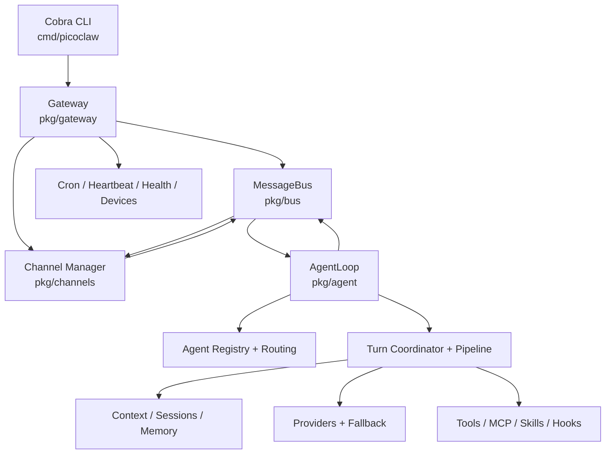
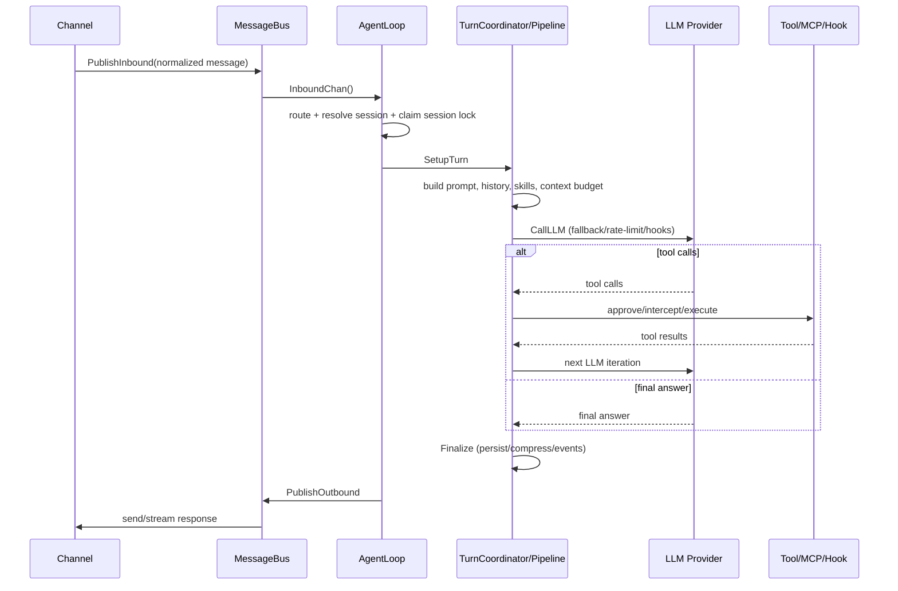

# PicoClaw 系统鸟瞰

## 分层与职责

**启动路径。** `cmd/picoclaw/main.go` 建立 Cobra 子命令；`gateway` 子命令进入 `pkg/gateway.Run`。后者加载配置、打开监听端口和 PID 锁、创建 provider、`MessageBus` 与 `AgentLoop`，再启动渠道管理器、cron、heartbeat、health、设备与可选语音服务。渠道通过入站消息写入 bus；Agent Loop 从 bus 消费，产出的回复再经 bus 或 Channel Manager 送出。

## 单次消息的回合路径

关键并发语义：`AgentLoop` 用 `activeTurnStates` 为同一 session 声明唯一活跃回合；后到的同会话消息进入 steering 队列，而不同会话由 `workerSem` 按 `max_parallel_turns` 并行处理。这是可用性和上下文一致性的核心设计。

## 主要扩展边界

| 边界 | 契约/入口 | 说明 |
| --- | --- | --- |
| 渠道 | `pkg/channels/interfaces.go`、registry、`Manager` | 各渠道实现接收/发送能力；在 gateway 使用 blank import 触发注册。 |
| 消息 | `pkg/bus` | 统一 inbound/outbound/media/audio/voice-control，带上下文校验、背压与 streaming delegate。 |
| 模型 | `pkg/providers/types.go`、factory、fallback | `LLMProvider` 抹平协议差异；支持 OpenAI-compatible、Anthropic、Azure、Bedrock、CLI/OAuth 等。 |
| 工具 | `pkg/tools/registry.go` 与 `pkg/agent/agent_init.go` | tool 定义、参数校验、执行与回传；Agent 在初始化时按配置注册。 |
| 外部能力 | `pkg/mcp`、`pkg/skills`、hooks | MCP 工具、文件系统技能与生命周期 hook 叠加到 Agent 回合。 |
| 状态与上下文 | `pkg/session`、`pkg/state`、`pkg/memory`、`pkg/seahorse` | session 作用域与 JSONL 历史；可选检索/压缩记忆路径。 |

## 配置与持久化

默认主目录是 `~/.picoclaw`，可由 `PICOCLAW_HOME` 覆盖；`PICOCLAW_CONFIG` 可直接指定配置文件。根 `Config` 统一承载 Gateway、模型、agents、channels、tools、MCP、cron 等配置。工作区中的 `AGENT.md`、`SOUL.md`、`USER.md` 用于注入 agent 人设/任务上下文；session、state、日志和凭据在 home/workspace 周边落盘。

## 值得注意的架构取舍

- 实现以 package-level 单体为主，而非多个独立服务；部署轻，但 `gateway` 是较重的 composition root。
- `pkg/agent` 聚合度高，回合编排、工具、hook、媒体、上下文与子回合紧密协作；迁移时应先抽稳定接口，再移植实现。
- 运行时事件在 Agent 层集中发布，适合做可观测性和自演化的统一输入；比从日志反推状态更可靠。

